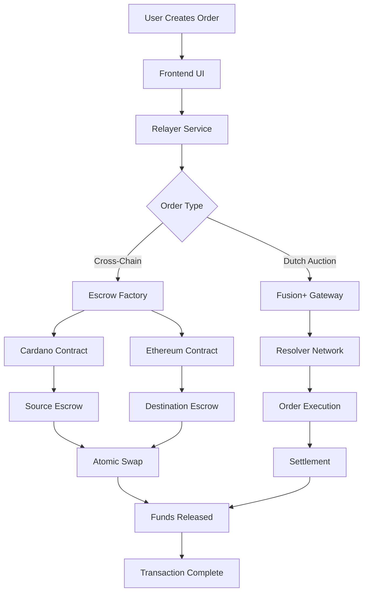

# Inchano - Cross-Chain DeFi Protocol with Dutch Auction Integration

A comprehensive cross-chain DeFi protocol that extends 1inch Fusion+ capabilities to enable atomic swaps between Cardano and Ethereum networks using Dutch auction mechanisms.

## 🌟 Overview

Inchano is a next-generation cross-chain DeFi protocol that facilitates seamless atomic swaps between Cardano and Ethereum blockchains. Built on top of 1inch Fusion+ technology, it implements Dutch auction mechanisms to optimize trade execution and provide MEV protection.

### Key Features

- 🔄 **Cross-Chain Atomic Swaps**: Secure token exchanges between Cardano and Ethereum
- 📈 **Dutch Auction Integration**: Dynamic pricing with 1inch Fusion+ protocol
- ⚡ **Real-time Order Broadcasting**: WebSocket-based order distribution to resolvers
- 🛡️ **MEV Protection**: Advanced mechanisms to prevent front-running
- 🔍 **Escrow Monitoring**: Real-time tracking of cross-chain transactions
- 🎯 **Resolver Network**: Decentralized execution through resolver participants

## 🏗️ Architecture

### System Components

```
┌─────────────────┐    ┌─────────────────┐    ┌─────────────────┐
│   Frontend UI   │    │  Relayer Core   │    │ Gateway Service │
│    (Next.js)    │◄──►│   (Node.js)     │◄──►│   (Fusion+)     │
└─────────────────┘    └─────────────────┘    └─────────────────┘
         │                       │                       │
         │                       │                       │
         ▼                       ▼                       ▼
┌─────────────────┐    ┌─────────────────┐    ┌─────────────────┐
│ Smart Contracts │    │  Escrow Monitor │    │ Resolver Network│
│  (Cardano/ETH)  │    │   (WebSocket)   │    │  (WebSocket)    │
└─────────────────┘    └─────────────────┘    └─────────────────┘
```

### Flow Diagram



## 📦 Project Structure

```
Inchano/
├── app/                          # Frontend Application (Next.js)
│   ├── src/
│   │   ├── components/           # React components
│   │   │   ├── dutch-auction-animation.tsx
│   │   │   └── client-only.tsx
│   │   └── app/
│   │       └── resolver/         # Resolver UI components
│
├── relayer/                      # Core Relayer Service (Node.js/TypeScript)
│   ├── src/
│   │   ├── controllers/          # API route handlers
│   │   ├── services/             # Business logic
│   │   │   ├── cardano.service.ts
│   │   │   ├── ethereum.service.ts
│   │   │   └── lop-integration.service.ts
│   │   ├── database/             # Order management
│   │   └── utils/                # Utilities and logging
│   └── scripts/                  # Deployment and testing
│
├── relayer-service/              # Advanced Service Components
│   ├── src/
│   │   ├── gateway/              # Fusion+ Order Gateway
│   │   ├── escrow-monitor/       # Cross-chain monitoring
│   │   ├── services/             # Order processing
│   │   └── routes/               # API endpoints
│
├── limit-order-protocol-cardano/ # Cardano Smart Contracts (Haskell)
│   ├── src/
│   │   └── Contracts/            # Plutus smart contracts
│   ├── scripts/                  # Deployment scripts
│   └── app/                      # CLI deployment tools
│
├── cross-chain-swap-cardano/     # Cross-Chain Escrow (Haskell)
│   ├── src/
│   │   └── Contracts/            # Escrow contracts
│   ├── txn_examples/             # Transaction examples
│   └── deployment/               # Contract deployments
│
└── resolver/                     # Resolver Implementation
    └── fusion-resolver-example/  # Reference resolver
```

## 🚀 Getting Started

### Prerequisites

- **Node.js** 18+ (for JavaScript/TypeScript components)
- **Haskell Stack** (for Cardano smart contracts)
- **Cardano Node** access (Preprod testnet)
- **Ethereum Node** access (Sepolia testnet)
- **Blockfrost API** key
- **Infura/Alchemy** API key

### Environment Setup

1. **Clone the repository**
   ```bash
   git clone <repository-url>
   cd Inchano
   ```

2. **Install dependencies**
   ```bash
   # Relayer service
   cd relayer && npm install
   
   # Frontend application
   cd ../app && npm install
   
   # Relayer service components
   cd ../relayer-service && npm install
   ```

3. **Configure environment variables**
   ```bash
   # Copy environment template
   cp relayer/.env.example relayer/.env
   
   # Edit with your credentials
   nano relayer/.env
   ```

   Required variables:
   ```env
   # Cardano Configuration
   BLOCKFROST_PROJECT_ID=your_blockfrost_project_id
   CARDANO_NETWORK=preprod
   CARDANO_WALLET_SEED_PHRASE=your_cardano_wallet_seed

   # Ethereum Configuration
   SEPOLIA_RPC_URL=https://sepolia.infura.io/v3/your_key
   ETHEREUM_PRIVATE_KEY=0xYourPrivateKey

   # Service Configuration
   PORT=3000
   NODE_ENV=development
   ```

### Quick Start

1. **Start the relayer service**
   ```bash
   cd relayer
   npm run dev
   ```

2. **Launch the gateway service**
   ```bash
   cd relayer-service
   npm run build
   npm start
   ```

3. **Run the frontend**
   ```bash
   cd app
   npm run dev
   ```

4. **Deploy smart contracts** (if needed)
   ```bash
   cd limit-order-protocol-cardano
   npm run deploy
   
   cd ../cross-chain-swap-cardano
   npm run deploy
   ```

## 🔧 Core Components

### 1. Relayer Service (`/relayer`)

The heart of the Inchano protocol, handling cross-chain coordination and order management.

**Key Features:**
- Cross-chain communication between Cardano and Ethereum
- Dutch auction coordination with 1inch Fusion+
- RESTful API for monitoring and control
- WebSocket integration for real-time updates

**API Endpoints:**
- `GET /health` - Service health check
- `GET /status` - Network and contract status
- `POST /swap/initiate` - Initiate cross-chain swaps
- `GET /cardano/wallet` - Cardano wallet information
- `GET /ethereum/wallet` - Ethereum wallet information

### 2. Fusion+ Gateway (`/relayer-service/src/gateway`)

WebSocket gateway connecting to 1inch Fusion+ for order broadcasting and resolver coordination.

**Features:**
- Real-time order streaming from 1inch Fusion+
- Resolver network broadcasting
- Dutch auction monitoring
- Profitability analysis

### 3. Escrow Monitor (`/relayer-service/src/escrow-monitor`)

Real-time monitoring service for Ethereum escrow contracts.

**Capabilities:**
- WebSocket-based event monitoring
- Multi-contract support
- State tracking and lifecycle management
- Automatic reconnection handling

### 4. Smart Contracts

#### Cardano Contracts (`/limit-order-protocol-cardano`, `/cross-chain-swap-cardano`)
- **Limit Order Protocol**: Handles order creation and matching on Cardano
- **Escrow Factory**: Manages cross-chain swap escrows
- **Base Escrow**: Atomic swap primitives

#### Ethereum Integration
- Integration with existing 1inch Fusion+ contracts
- Custom escrow contracts for cross-chain operations

### 5. Frontend Application (`/app`)

Next.js-based user interface for interacting with the protocol.

**Components:**
- Dutch auction visualization
- Order creation and management
- Cross-chain swap interface
- Real-time price monitoring

## 📊 Network Information

### Cardano Preprod Testnet

- **Limit Order Protocol**: `addr_test1w9f069f153ac688ac08c97da0a29e7c061ba21dadae384edcfa2369fc`
- **Escrow Factory**: `addr_test1w1e0a111161ed6495ef29fac0c4209838724c26680d0420af26d5bcec`
- **Explorer**: [Preprod CardanoScan](https://preprod.cardanoscan.io)

### Ethereum Sepolia Testnet

- **Limit Order Protocol**: `0x7b728d06b49DB49b0858397fDBe48bC57a814AF0`
- **Escrow Factory**: `0xB0285B9817B7F798ba7a3AE141023ec0e0088cF0`
- **Explorer**: [Sepolia Etherscan](https://sepolia.etherscan.io)

## 🔄 Order Flow

### Dutch Auction Process

1. **Order Creation**: User creates a Dutch auction order with start/end prices
2. **Price Decay**: Price automatically decreases over time
3. **Resolver Detection**: Resolvers monitor for profitable opportunities
4. **Execution**: Best resolver executes the order at optimal price
5. **Settlement**: Funds are settled atomically

### Cross-Chain Swap Process

1. **Initiation**: User initiates cross-chain swap
2. **Escrow Creation**: Source and destination escrows are created
3. **Monitoring**: Both chains are monitored for state changes
4. **Coordination**: Relayer coordinates the atomic swap
5. **Completion**: Funds are released on both chains simultaneously

## 🧪 Testing

### Unit Tests
```bash
# Test relayer service
cd relayer && npm test

# Test gateway service
cd relayer-service && npm test
```

### Integration Tests
```bash
# Test cross-chain functionality
cd relayer && npm run test:integration

# Test contract interactions
npm run test:contracts
```

### End-to-End Testing
```bash
# Full protocol test
npm run test:e2e
```

## 📈 Monitoring and Logging

- **Winston Logging**: Comprehensive logging across all services
- **Health Checks**: Built-in health monitoring endpoints
- **Error Tracking**: Detailed error reporting and recovery
- **Performance Metrics**: Real-time performance monitoring

## 🔒 Security

- **Private Key Management**: Secure storage and handling
- **Contract Validation**: Thorough contract address verification
- **Network Security**: Secure RPC connections
- **Audit Trail**: Complete transaction logging

## 🤝 Contributing

We welcome contributions! Please see our [Contributing Guidelines](CONTRIBUTING.md) for details.

### Development Workflow

1. Fork the repository
2. Create a feature branch
3. Make your changes
4. Add comprehensive tests
5. Submit a pull request

## 📄 License

This project is licensed under the MIT License - see the [LICENSE](LICENSE) file for details.

## 🆘 Support

- **Documentation**: Check the component-specific READMEs
- **Issues**: Create GitHub issues for bugs or feature requests
- **Community**: Join our Discord/Telegram for discussions

## 🎯 Roadmap

### Phase 1 (Current)
- ✅ Core relayer service
- ✅ Cardano smart contracts
- ✅ Ethereum integration
- ✅ Basic Dutch auction support

### Phase 2 (In Progress)
- 🔄 Advanced resolver network
- 🔄 Enhanced MEV protection
- 🔄 Production deployment
- 🔄 Comprehensive monitoring

### Phase 3 (Planned)
- 📋 Multi-chain expansion
- 📋 Advanced order types
- 📋 Governance token
- 📋 DAO implementation

---

**Built with ❤️ by the Inchano Team**

*Bridging the gap between Cardano and Ethereum ecosystems through innovative cross-chain DeFi solutions.*
